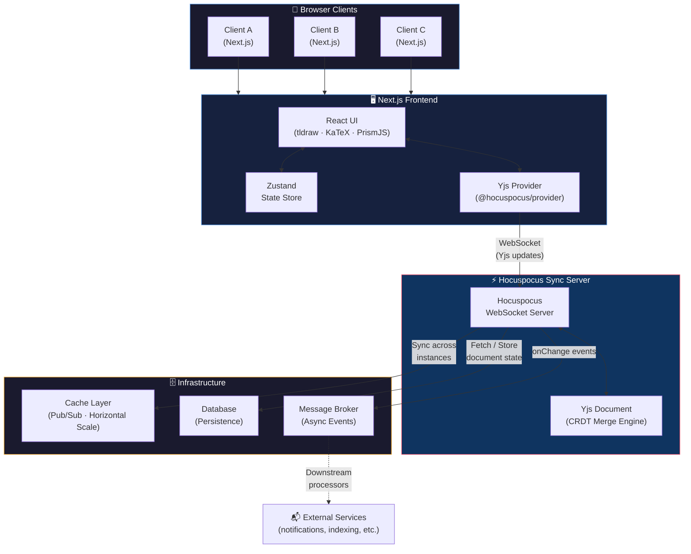

# 🐧 PenGoin

> A real-time collaborative document & whiteboard editor — rich text, math, code, and drawing, all in one place.


---

## What is PenGoin?

PenGoin is a multiplayer-first workspace where teams can write, draw, and think together without stepping on each other's toes. It combines a feature-rich document editor (with LaTeX math and syntax-highlighted code) and a collaborative whiteboard powered by tldraw — all kept in sync across every connected client in real time via Yjs CRDTs.

The name says it all: **Pen** (writing/drawing) + **Goin** (always going, always live).

---

## Features

- **Real-time collaboration** — multiple users edit simultaneously with no conflicts, thanks to Yjs Conflict-free Replicated Data Types (CRDTs)
- **Rich text editing** — full document editor with headings, lists, inline formatting and more
- **LaTeX math rendering** — write equations with KaTeX, rendered beautifully in the editor
- **Syntax-highlighted code blocks** — powered by PrismJS for dozens of languages
- **Collaborative whiteboard** — infinite canvas drawing and diagramming with tldraw
- **Persistent documents** — all document state is durably stored and survives server restarts
- **Horizontally scalable sync server** — a caching layer lets you run multiple sync server instances behind a load balancer
- **Async event pipeline** — document change events are dispatched asynchronously for downstream processing
- **Docker-ready** — ships with a `Dockerfile` pre-configured for Hugging Face Spaces

---

## Architecture



### How it works

When a user makes an edit, the change is applied locally and instantly streamed over WebSocket to the sync server. The server merges it with the canonical document state using CRDT logic and broadcasts the resolved update to every other connected client. Documents are persisted to the database so they survive restarts. The caching layer keeps multiple server instances in sync for horizontal scaling, and change events are dispatched asynchronously for any downstream processing.

---

## Tech Stack

| Layer | Technology | Purpose |
|---|---|---|
| Frontend framework | Next.js 16 + React 19 | App shell & routing |
| Language | TypeScript 5 | End-to-end type safety |
| UI | Tailwind CSS 4 | Styling |
| Whiteboard | tldraw 5 | Infinite canvas |
| Math | KaTeX | LaTeX equation rendering |
| Code highlighting | PrismJS | Syntax highlighting |
| State management | Zustand 5 | Client-side store |
| Collaboration | Yjs + Hocuspocus | CRDT-based real-time sync |
| Persistence | PostgreSQL (managed) | Document storage |
| Scaling | Redis-compatible cache | Multi-instance pub/sub |
| Messaging | AMQP message broker | Async event queue |
| Containerisation | Docker | Deployment |

---

## Project Structure

```
PenGoin/
├── src/                   # Next.js application source
│   └── app/               # App Router pages & components
├── public/                # Static assets
├── server.ts              # Hocuspocus WebSocket sync server
├── next.config.ts         # Next.js configuration
├── Dockerfile             # Container image for the sync server
├── SRS_SDA.pdf            # Software Requirements & Design doc
└── package.json
```

The repository intentionally separates the **Next.js frontend** (`src/`) from the **Hocuspocus sync server** (`server.ts`). In production these are two independently deployable processes (or containers).

---

## Prerequisites

- Node.js ≥ 20
- npm ≥ 10

---

## Getting Started

### 1. Clone & install

```bash
git clone https://github.com/aabir-2004/PenGoin.git
cd PenGoin
npm install
```

### 2. Configure environment variables

Copy `.env.example` to `.env.local` and fill in your credentials. The app requires a database connection for persistence; caching and messaging services are optional and will be skipped gracefully if not configured.

### 3. Run the sync server

```bash
npm run sync
```

### 4. Run the Next.js frontend

```bash
npm run dev         # http://localhost:3000
```

Open the app in two browser tabs to see real-time collaboration in action.

---

## Docker Deployment

A `Dockerfile` is included for containerised deployment of the sync server.

```bash
docker build -t pengoin-sync .
docker run -p 7860:7860 --env-file .env pengoin-sync
```

Deploy the Next.js frontend separately (e.g. Vercel) and configure it to point at your running sync server.

---

## Available Scripts

| Script | Description |
|---|---|
| `npm run dev` | Start Next.js in development mode |
| `npm run build` | Build Next.js for production |
| `npm run start` | Start Next.js production server |
| `npm run sync` | Start the Hocuspocus WebSocket sync server |
| `npm run lint` | Run ESLint |

---

## Contributing

Contributions are welcome! Please open an issue first to discuss what you'd like to change, then submit a pull request against `master`.

1. Fork the repository
2. Create a feature branch (`git checkout -b feat/your-feature`)
3. Commit your changes (`git commit -m 'feat: add your feature'`)
4. Push to the branch (`git push origin feat/your-feature`)
5. Open a pull request

---

## License

This project is open source. See the repository for license details.
